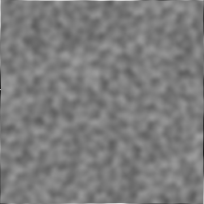

# Summary
Project developped for a virtual world course. Uses [gkit2light](https://perso.univ-lyon1.fr/jean-claude.iehl/Public/educ/M1IMAGE/html/group__installation.html) for rendering. Generates a procedural terrain, computes metrics and uses them for road generation and town placement

## Terrain generation
Terrain is generated on a discrete 2D grid with simplex noise using the FastNoiseLite repo. 

Once the terrain is generated, computes and exports maps containing informations for each element of the grid:
- The height

- The slope

- The Laplacian

- The drainage area (zones where the water would have flown on the terrain)

The terrain can be eroded using a stream power erosion algorithm, it uses all of the maps cited earlier.

## Town generation
We generate a map of interest points to know where a town could be built. For this, we give to each pixel of the terrain grid a weight depending on 3 factors: the height, the drainage area and the slope. 
basically, we are looking for the points that are as high as possible, as flat as possible and as close to the water as possible (without being under water of course).

## Road generation
We can then generate roads to link our towns, using dijkstra's shortest path algorithm. To be that all our towns are linked together without having a road from each town to every other town, we remove certain paths that are longer than reusing a preexisting road.

